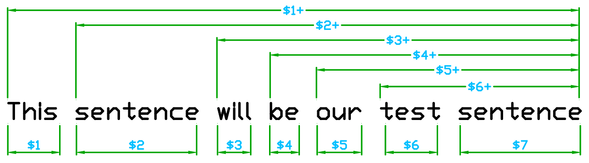

# Placeholders/Variables


**Quick reminder:** You must include the brackets { } when typing the placeholder so Cakey Bot knows to replace it with the correct values.




Don't know how to find role/channel/user IDs? You can use this extremely detailed and easy to follow guide [here](https://support.discord.com/hc/en-us/articles/206346498-Where-can-I-find-my-User-Server-Message-ID) written by Discord.


## Basic Placeholders

### User

`{@username}` - Mentions a specific user. Replace **"username"** with their username  
`<@userid>` - Mentions a specific user. Replace **"userid"** with their user ID _\(More reliable\)_  
`{user.id}` - The ID of the user  
`{user.nick}` - The user’s nickname **excluding** the discriminator  
`{user.nickname}` - The user’s nickname **including** the discriminator  
`{user}` - The username of the user **excluding** the discriminator  
`{user.username}` - The user’s username **including** the discriminator  
`{user.discriminator}` - The user’s discriminator  
`{user.avatar}`- The user’s avatar URL  
`{user.mention}` - Mentions the user  
`{user.createdAt}` - The user’s registration date  
`{user.joinedAt}` - The user’s server join date

### Channel

`{channel}` - The channel name where the command was used  
`{channel.id}` - Channel ID  
`{channel.name}` - Channel name  
`{channel.mention}` - Channel mention  
`{#channel}` - A channel mention. Replace "**channel"** with the name of the channel  
`<#channelid>` - A channel mention. Replace "**channelid**" with the ID of the channel _\(More reliable\)_

### Server

`{server.id}` - Server’s ID  
`{server.name}` - Server’s name  
`{server.icon}` - Server’s icon  
`{server.memberCount}` - Number of members in the server  
`{server.ownerID}` - Owner’s ID  
`{server.createdAt}` - Server’s creation date  
`{server.region}` - Server’s region  
`{server.ownername}` - Owner’s Username  
`{server.splashurl}` - Splash URL \(if one is set\)  
`{server.bannerurl}` - Banner URL \(if one is set\)  
`{server.verificationlevel}` - The server's verification/moderation level  
`{server.vanityurl}` - Vanity URL code  
`{server.boostlevel}` - Boosted tier level  
`{server.boostcount}` - The number of boosts the server has  
`{server.vanityurl}` - Vanity URL code  
`{server.afkchannel}` - AFK channel name  
`{server.afktimeout}` - The AFK timeout \(in seconds\)  
`{server.countallchannels}` - The number of channels in the server  
`{server.counttextchannels}` - The number of **text** channels in the server  
`{server.countvoicechannels}` - The number of **voice** channels in the server  
`{server.countemoji}` - The number of emoji in the server  
`{server.countroles}` - The number of roles in the server

### Role

`{&role}` - Mention a role by name. Replace "**role"** with the role name  
`<@&roleid>` - Mention a role. Replace "**roleid"** with the role ID _\(More reliable\)_

### Time & Date

`{time}` - Current 24 hour time  
`{time12}` - Current 12 hour time  
`{date}` - Current date  
`{datetime}` - Current date with the 24 hour time  
`{datetime12}` - Current date with the 12 hour time


Currently, all times & dates are for the United States Eastern timezone. In the future, you will be able to select your timezone per-server.


### Other

`{everyone}` - Mentions `@everyone`  
`{noeveryone}` - Disables `@everyone` \(being able to mention everyone\) in the command  
`{here}` - Mentions `@here`  
`{nohere}` - Disables `@here` \(being able to mention everyone online with `@here`\) in the command  
`{nomentions}` - Disables **ALL** mentions in the command **including** `@everyone`, `@here`, role mentions & user mentions.  
`{prefix}` - Show command prefix for the server  
`{messagelink}` - Displays a Discord message link/url to the original command/message that triggered the response  
`{quote:#channelid}` - Quote the last message in the provided channel. Replace "**channelid**" with the ID of the channel  
`{random:min:max}` - Generates a random number between the min/max. Replace "**min**" and "**max**" with a number between 0 and 999,999,999. **Note:** Your minimum number must be smaller than your maximum number.

## Advanced Placeholders


_Advanced Placeholders only work on "Auto Responder" and "Custom Commands". They will **not** work on join/leave/ban announcements._


### **Delete**


**Note:** Delete placeholders will not work while using DM placeholders on a command.


`{delete}` - Delete initial command the user sent after the response sent  
`{deleteafter:x}` - Delete the response automatically after `X` amount of seconds. Replace the `x` with a number between 1 and 9.  
`{confirmdelete}` - Add a trashcan reaction to the response that deletes it after it is clicked. \(Similar to AFK messages\) _Note: The ability to delete will expire after 60 seconds._


These require Cakey Bot to have "Manage Message" permissions. `{confirmdelete}` also requires Cakey Bot to have access to add reactions to messages.


### **Require**

`{require:&role}` - Set the required role to use the command. Replace "**role**" with the role ID.  
`{require:#channel}` - Set the required channel that the command can be run in. Replace "**channel**" with the channel ID.  
`{require:@user}` - Set the specific user who can use this command. Replace "**user**" with the user ID.

Examples:

```text
{require:&237273200055156736}    //Specific role ID

{require:#225182513465786369}    //Specific channel ID

{require:@225182513465786369}    //Specific user ID
```

### **Not**

`{not:&role}` - Blacklist a specific role from using the command. Replace "**role**" with the role ID.  
**\*\*`{not:#channel}` - Blacklist the command from being run in a specific channel. Replace "**channel**" with the channel ID.  
`{not:@user}` - Blacklist a specific user from using the command. Replace "**user\*\*" with the user ID.

Examples:

```text
{not:&237273200055156736}    //Specific role ID

{not:#225182513465786369}    //Specific channel ID

{not:@225182513465786369}    //Specific user ID
```

### **Respond**

`{respond:#channel}` - The channel that the command will send the response to. Replace "**channel**" with the channel ID. _Limited to one channel per command._

### **DM**


In order to decrease the chances to abuse this placeholder, it is a [**Premium Only**](https://cakeybot.app/premium.html) placeholder.



Cakey Bot can sometimes fail to send a DM if the user has their privacy settings set to block DMs from users in the server. This is NOT a bug and not something Cakey Bot can bypass.


`{dm}` - Direct message the bot response to the user who called the command. _**Limited to one DM per command.**_  
**\*\*`{dm:@user}` - Direct message the bot response to the specified user. Replace "**user**" with the user ID. \_**Limited to one DM per command.\*\*\_

Examples:

```text
{dm:@225182513465786369}    //Specific user ID
```


Spamming commands that use this variable will lead to your server being blacklisted from using Custom Commands.


### Response Chance

Don't want to have the bot respond every...single...time? Well with the response chance placeholder, you can set a percentage between 0% and 100% for the bot to respond or not respond to the trigger. This works on both Auto Responders and Custom Commands. Also, only the first chance placeholder will be taken into account, any extras will be ignored. You can see some examples below:

```text
{chance:0}   //0% chance to respond
{chance:35}  //35% chance to respond
{chance:100} //100% chance to respond
```

_\(Note: You don't need `{chance:100}` to make the bot respond all the time, simply excluding **any** chance placeholder will act as 100%\)_

### **Link/URL Buttons**

`{linkbutton:(text)[url]}` - Adds a link button to the message. Replace "text" with what you want the button to say and replace "url" with the link/url you want the button to open in the browser. _There is a limit of 25 buttons per message/response and a max of 80 characters for the button text._

Examples:

```text
{linkbutton:(Cakey Bot)[https://cakeybot.app]}
{linkbutton:(Open Link)[https://google.com]}
{linkbutton:(Some Random Text)[https://youtube.com]}
```

### **Reactions**


**Note:** This placeholder will not work on messages that use `{confirmdelete}` or `{dm}`. Also, Cakey Bot can ONLY use Emoji from any server that Cakey Bot is in. \(Similar to nitro users\)



Due to rate limit concerns, this is a [**Premium Only**](https://cakeybot.app/premium.html) placeholder to discourage abuse.


You can also add reactions to responses \(up to 3\). To add a reaction simply include a reaction placeholder anywhere in the response string. You will need to get Discord's unique ID for the reaction you plan to use. You can do this by typing the emoji in Discord and placing a backslash in front of it. Some placeholder examples are shown here:

```text
{react:<a:200IQ:730769872698736692>} //Animated/Gif Emote
{react:<:r6s:847490914749382719>}    //Custom Server Emote
{react:😄}                           //Normal Unicode Emote
```

### **Choose & Choice**

The `{choose:}` and `{choice}` variables let you pick random items from a list or lists.  
To set up a list, use `{choose:item1;item2;item3}`. You can have up to 10 lists, using `{choose1:}`, `{choose2:}`, and so on. You can have up to 10 items per list.

`{choice}` - Get a random value from your list.  
`{choice3}` - Get a random value from list 3.

Examples:

```text
{choose:pie;cake;icecream;}
{user.Username} likes {choice}

{choose1:apples;oranges;pears}
{choose2:dogs;cats;horses}
My favorite fruit is {choice1} and my favorite animal is {choice2}!
```

### Arguments/$N Variable \(Custom Commands Only\)

`$N` - Returns a command argument.

**Examples:**

```text
Input: !slap Joe a big fish
Response: You slapped $1 with $2 $3+
Result: You slapped Joe with a big fish
```

$1 represents the first argument \(Joe\) in the command call.  
$2 represents the second argument \(a\), and so on.  
$3+ represents all the arguments after the first one in the command call \(big fish\) since Joe is the first argument.


Remember, do not include this variable in the initial command. Place $1 $2 and so on in the command response.




