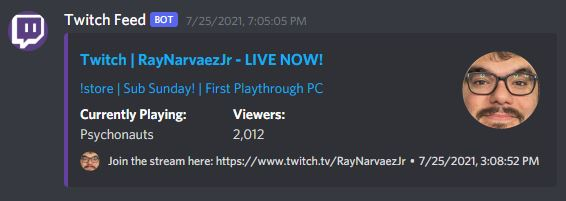

# Live Feeds

## Overview

Cakey Bot has the ability to send live updates and notifications to specific channels using web hooks. While Cakey Bot only supports a few official sources, you can attempt to use the "generic RSS" feed to post live updates of less-common feeds. You can set up these feeds via the "Social Feeds" page on the web dashboard.

## Setup/Add Feeds

1. Login to our [web dashboard](https://cakeybot.app/dashboard/).
2. Go to "Social Feeds" [here](https://cakeybot.app/dashboard/public/feeds).
3. Click the tab for the feed you want to add \(i.e. Reddit, Twitter, etc\)
4. Click the "Add New Feed" button
5. Fill in the required information. All feeds will require a channel ID and a web hook URL for that channel in order to post messages there. You can read how to create a web hook URL here.
6. Click "Create"


**Note:** It can take _up to_ 5 minutes for modifications/additions to sync with the bot. After that, most feeds will search for new content/events every 10 seconds to 1 minute depending on the feed type and rate limits.


## Reddit

## Youtube


Not implemented yet.


## Twitch

## Twitter


Not implemented yet.


## Generic RSS


Not implemented yet.


