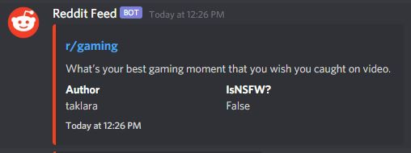

# Social Feeds

## Overview

Cakey Bot has the ability to send live updates and notifications to specific channels using web hooks. While Cakey Bot only supports a few official sources, you can suggest less-common feeds for us to look into adding though! You can set up these feeds via the "Social Feeds" page on the web dashboard.

## Setup/Add Feeds

1. Login to our [web dashboard](https://cakeybot.app/dashboard/).
2. Go to "Social Feeds" [here](https://cakeybot.app/dashboard/public/feeds).
3. Click the tab for the feed you want to add (i.e. Reddit, Twitch, etc)
4. Click the "Add New Feed" button
5. Fill in the required information. All feeds will require a channel ID and a web hook URL for that channel in order to post messages there. You can read how to create a web hook URL [here](https://support.discord.com/hc/en-us/articles/228383668-Intro-to-Webhooks).
   1. You can optionally set a custom embed color and a role to ping for new notifications.
6. Click "Create"


**Note:** It can take _up to_ 5 minutes for modifications/additions to sync with the bot. After that, most feeds will search for new content/events every 10 seconds to 1 minute depending on the feed type and rate limits.









**Notice:** Due to how slowly YouTube's video RSS feeds update, upload notifications can be delayed _UP TO_ 30 minutes after the actual upload time. &#x20;


<figure><figcaption></figcaption></figure>




Reddit feeds currently require a premium subscription to use due to rate limit concerns.




